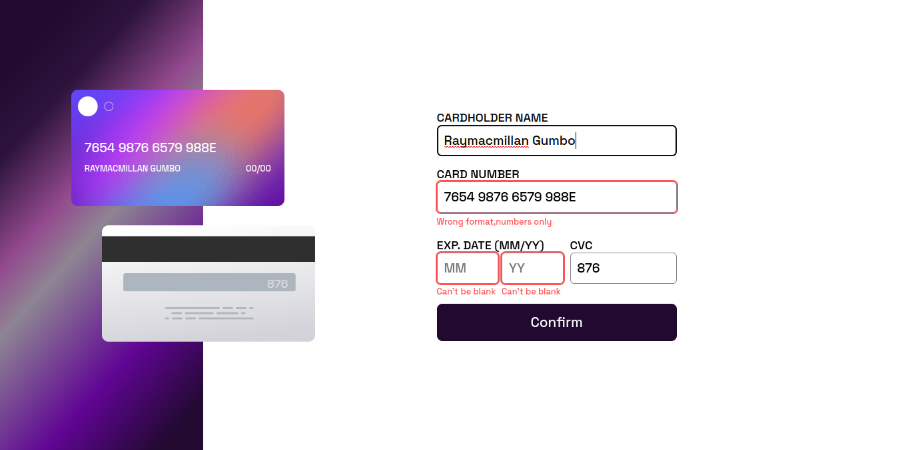

# Frontend Mentor - Interactive card details form solution

This is a solution to the [Interactive card details form challenge on Frontend Mentor](https://www.frontendmentor.io/challenges/interactive-card-details-form-XpS8cKZDWw). Frontend Mentor challenges help you improve your coding skills by building realistic projects. 

## Table of contents

- [Overview](#overview)
  - [The challenge](#the-challenge)
  - [Screenshot](#screenshot)
  - [Links](#links)
- [My process](#my-process)
  - [Built with](#built-with)
  - [What I learned](#what-i-learned)
  - [Useful resources](#useful-resources)
- [Author](#author)

## Overview

### The challenge

Users should be able to:

- Fill in the form and see the card details update in real-time
- Receive error messages when the form is submitted if:
  - Any input field is empty
  - The card number, expiry date, or CVC fields are in the wrong format
- View the optimal layout depending on their device's screen size
- See hover, active, and focus states for interactive elements on the page

### Screenshot

### Links

- Solution URL: [https://github.com/Raymacmillan/Interactive-Card-Details-Form/settings/pages](https://github.com/Raymacmillan/Interactive-Card-Details-Form/settings/pages)
- Live Site URL: [https://raymacmillan.github.io/Interactive-Card-Details-Form/](https://raymacmillan.github.io/Interactive-Card-Details-Form/)

## My process

### Built with

- Flexbox
- Mobile-first workflow

### What I learned

I learn't about regular expressions.I realised that i made a lot of mistakes with my HTML as i did not take a closer look to all the designs of my task so in my next project i will make sure to firstly assess every design to have a clear picture of the foundation(HTML) and plan ahead in time

**Note: Delete this note and the content within this section and replace with your own learnings.**

### Continued development

I realised that i still have a weakness in Javascript and i would like to continue working on many projects inorder to improve and sharpen my programming problem solving skills

## Author

- Frontend Mentor - [@Raymacmillan](https://www.frontendmentor.io/profile/Raymacmillan)
- Twitter - [@RyoGenex](https://twitter.com/RyoGenex)

